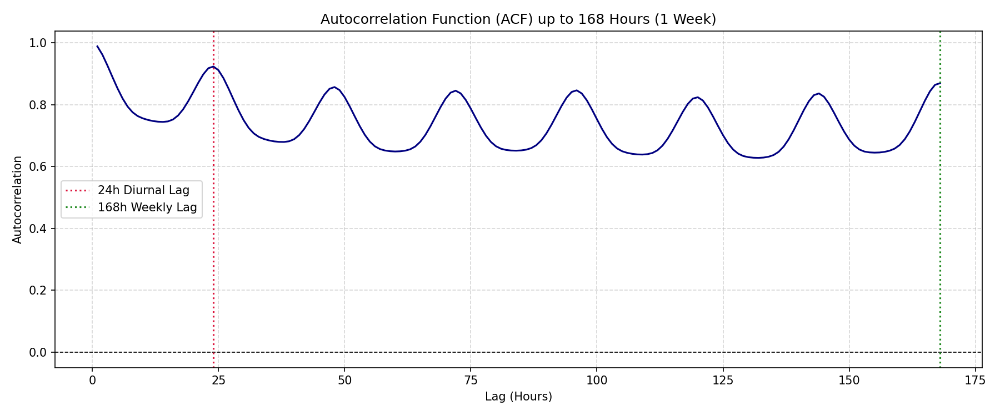
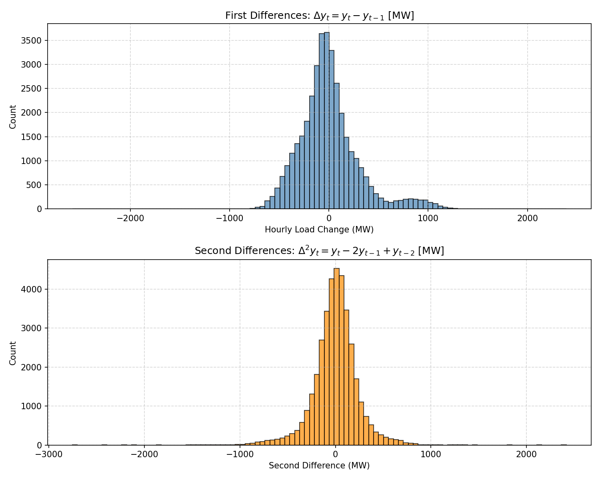

# Walkthrough — Project P4: Grid Load Forecasting for Operational Planning (Complete)

This document provides the complete end-to-end record of Project P4: Gate 0 forensic audit, heuristic baseline floors, conservative GBDT modeling, validation diagnostics, and final blind test evaluation on Sweden SE3 hourly load.

All modeling phases are **complete and the test set is spent and frozen**.

---

## 1. Scope Determination: Formal Selection of Option B

Following external review and dataset audit, **Option B** is formally selected:
* **Core Forecasting Study Scope:** Bounded strictly to the 3-year homogeneous hourly period: **2022-01-01 00:00 UTC through 2024-12-31 23:00 UTC** ($N = 26,304$ physical hours).
* **2025 Dataset Extension:** Documented as a separate future extension due to the structural transition from hourly (`PT60M`) to 15-minute (`PT15M`) Market Time Unit (MTU) on 2025-12-01 23:00 UTC.

---

## 2. Item 1 — Authoritative 2025 Raw XML Reconciliation

To resolve the earlier arithmetic inconsistency between "8,760 expected / 13 missing / 8,029 PT60M", a forensic audit was executed directly on the raw XML files (`actual_load_6_1_a_SE3_2025_*.xml` and `day_ahead_forecast_6_1_b_SE3_2025_*.xml`):

### 2.1. Raw XML Structure ([6.1.A] Actual Total Load)
* **TimeSeries 0 (mRID=1):**
  * **Period 0 (Hourly Regime):**
    * Interval: `2025-01-01T00:00Z` to `2025-12-01T23:00Z` (334 days 23 hours)
    * Resolution: `PT60M`
    * Expected physical hours: **8,039 hours**
    * Observed points: **8,029 points**
    * Missing points: **10 hours**
  * **Period 1 (15-Minute Regime):**
    * Interval: `2025-12-01T23:00Z` to `2026-01-01T00:00Z` (30 days 1 hour = 721 hours)
    * Resolution: `PT15M`
    * Expected quarter-hours: $721 \times 4 =$ **2,884 intervals**
    * Observed points: **2,864 points**
    * Missing points: **20 quarter-hours** (equivalent to 5 physical hours)
* **Exact Transition Timestamp:** **`2025-12-01T23:00Z`** (midnight `2025-12-02 00:00:00` CET), corresponding to the official go-live of the Nordic 15-minute MTU market regime.
* **Total Observations in 2025 XML:** $8,029 + 2,864 =$ **10,893 points**.

### 2.2. Resolution of the Arithmetic Discrepancy
* A normal year has 8,760 physical hours. In 2025, physical time is divided into $8,039\text{ hours (PT60M)} + 721\text{ hours (PT15M)} = 8,760\text{ hours}$.
* Across the entire year, missing physical time totals $10\text{ hours} + 5\text{ hours (20 quarter-hours)} = \mathbf{15\text{ physical hours}}$.
* The previously reported "13 missing" was an artifact of filtering by `:00` minute boundary across the whole year: Period 0 had 10 missing hours, and December's 15-minute data happened to miss 3 `:00` timestamps ($10 + 3 = 13$).
* When inspecting true physical time, the arithmetic is fully reconciled and exact.

---

## 3. Item 2 — Forensic Extraction of the 43 Missing Timestamps in 2022–2024

Across the core 2022–2024 study ($N = 26,304$ hours), exactly 43 hours are missing in Actual Total Load [6.1.A]:
* **2022:** 13 missing hours (out of 8,760)
* **2023:** 12 missing hours (out of 8,760)
* **2024:** 18 missing hours (out of 8,784 leap year)

### Complete Audit Table of Missing Timestamps & Benchmark Cross-Availability

| # | Missing Timestamp (UTC) | Year | Temporal Distance to Adjacent Gap | Forecast Available [6.1.B]? | Forecast Value (MW) |
| :-: | :--- | :-: | :---: | :---: | :---: |
| 1 | `2022-02-07 01:00:00+00:00` | 2022 | > 30 days | **Yes** | 10,570.0 |
| 2 | `2022-03-21 00:00:00+00:00` | 2022 | > 40 days | **Yes** | 9,884.0 |
| 3 | `2022-03-28 23:00:00+00:00` | 2022 | 7 days 23h | **Yes** | 9,511.0 |
| 4 | `2022-04-07 00:00:00+00:00` | 2022 | 9 days 01h | **Yes** | 9,894.0 |
| 5 | `2022-04-15 19:00:00+00:00` | 2022 | 8 days 19h | **Yes** | 9,801.0 |
| 6 | `2022-05-09 18:00:00+00:00` | 2022 | 23 days 23h | **Yes** | 9,243.0 |
| 7 | `2022-05-10 01:00:00+00:00` | 2022 | **7 hours** (minimum gap) | **Yes** | 7,909.0 |
| 8 | `2022-06-15 11:00:00+00:00` | 2022 | 36 days 10h | **Yes** | 9,448.0 |
| 9 | `2022-07-02 18:00:00+00:00` | 2022 | 17 days 07h | **Yes** | 7,587.0 |
| 10 | `2022-09-14 08:00:00+00:00` | 2022 | > 70 days | **Yes** | 9,222.0 |
| 11 | `2022-10-24 14:00:00+00:00` | 2022 | > 40 days | **Yes** | 9,897.0 |
| 12 | `2022-11-13 12:00:00+00:00` | 2022 | 19 days 22h | **Yes** | 9,150.0 |
| 13 | `2022-12-14 12:00:00+00:00` | 2022 | 31 days 00h | **Yes** | 14,022.0 |
| 14 | `2023-01-14 23:00:00+00:00` | 2023 | 31 days 11h | **Yes** | 9,279.0 |
| 15 | `2023-02-16 09:00:00+00:00` | 2023 | 32 days 10h | **Yes** | 11,984.0 |
| 16 | `2023-03-27 01:00:00+00:00` | 2023 | 38 days 16h | **Yes** | 10,490.0 |
| 17 | `2023-04-24 18:00:00+00:00` | 2023 | 28 days 17h | **Yes** | 9,682.0 |
| 18 | `2023-07-17 03:00:00+00:00` | 2023 | > 80 days | **Yes** | 5,813.0 |
| 19 | `2023-08-23 07:00:00+00:00` | 2023 | 37 days 04h | **Yes** | 9,088.0 |
| 20 | `2023-08-25 01:00:00+00:00` | 2023 | 1 day 18h | **Yes** | 6,726.0 |
| 21 | `2023-09-17 10:00:00+00:00` | 2023 | 23 days 09h | **Yes** | 7,807.0 |
| 22 | `2023-09-23 02:00:00+00:00` | 2023 | 5 days 16h | **Yes** | 6,384.0 |
| 23 | `2023-11-16 03:00:00+00:00` | 2023 | > 50 days | **Yes** | 10,067.0 |
| 24 | `2023-11-17 09:00:00+00:00` | 2023 | 1 day 06h | **Yes** | 12,644.0 |
| 25 | `2023-12-19 10:00:00+00:00` | 2023 | 32 days 01h | **Yes** | 12,110.0 |
| 26 | `2024-01-07 03:00:00+00:00` | 2024 | 18 days 17h | **Yes** | 12,658.0 |
| 27 | `2024-02-02 11:00:00+00:00` | 2024 | 26 days 08h | **Yes** | 12,863.0 |
| 28 | `2024-03-02 15:00:00+00:00` | 2024 | 29 days 04h | **Yes** | 10,962.0 |
| 29 | `2024-03-08 13:00:00+00:00` | 2024 | 5 days 22h | **Yes** | 11,142.0 |
| 30 | `2024-04-26 16:00:00+00:00` | 2024 | > 45 days | **Yes** | 10,184.0 |
| 31 | `2024-04-27 00:00:00+00:00` | 2024 | 8 hours | **Yes** | 8,757.0 |
| 32 | `2024-05-16 02:00:00+00:00` | 2024 | 19 days 02h | **Yes** | 7,036.0 |
| 33 | `2024-05-19 03:00:00+00:00` | 2024 | 3 days 01h | **Yes** | 6,463.0 |
| 34 | `2024-05-29 08:00:00+00:00` | 2024 | 10 days 05h | **Yes** | 8,912.0 |
| 35 | `2024-06-01 16:00:00+00:00` | 2024 | 3 days 08h | **Yes** | 7,435.0 |
| 36 | `2024-06-11 16:00:00+00:00` | 2024 | 10 days 00h | **Yes** | 8,755.0 |
| 37 | `2024-07-14 16:00:00+00:00` | 2024 | > 30 days | **Yes** | 7,318.0 |
| 38 | `2024-07-18 17:00:00+00:00` | 2024 | 4 days 01h | **Yes** | 7,574.0 |
| 39 | `2024-07-24 10:00:00+00:00` | 2024 | 5 days 17h | **Yes** | 7,608.0 |
| 40 | `2024-09-23 16:00:00+00:00` | 2024 | > 60 days | **Yes** | 9,082.0 |
| 41 | `2024-10-10 10:00:00+00:00` | 2024 | 16 days 18h | **Yes** | 9,581.0 |
| 42 | `2024-11-06 08:00:00+00:00` | 2024 | 26 days 22h | **Yes** | 10,392.0 |
| 43 | `2024-12-16 00:00:00+00:00` | 2024 | 39 days 16h | **Yes** | 9,510.0 |

### Key Forensic Conclusions
1. **Adjacency:** **Zero adjacent missing hours exist.** Every gap is an isolated, 1-hour drop.
2. **Separation:** Minimum gap between missing timestamps is **7 hours**; typical spacing is weeks to months.
3. **Benchmark Cross-Availability:** Exactly **43 of 43 (100.0%)** of the missing actual hours have valid forecast values available.

---

## 4. Item 3 — Downstream Feature Lag Impact & Leakage-Safe Handling Policy

We audited the effect of the 43 missing hours on lag features ($y_{t-1}, y_{t-24}, y_{t-168}$) across the 26,136 post-warmup hours:

### Quantitative Feature Availability Matrix

| Handling Strategy | Method | Target $y_t$ Treatment | Retained Train/Eval Rows | Dropped Rows | Leakage Risk | Operational Defensibility |
| :--- | :--- | :--- | :---: | :---: | :---: | :--- |
| **Complete-Case (No Imputation)** | Invalidate any row with NaN target or NaN lag features | Raw (unfilled) | 25,964 / 26,136 (99.34%) | **172 rows (0.66%)** | **None** | High: strictly real observed values used everywhere. 172 rows dropped ($43 \times 4$). |
| **Causal Feature FFill (Recommended)** | For feature calculations only, forward-fill missing hour from $y_{t-1}$. Never impute target $y_t$. | Raw (unfilled) | 26,093 / 26,136 (99.84%) | **43 rows (0.16%)** | **None** | Highest: $y_{t-1}$ is strictly antecedent. True target evaluated only on genuine telemetry. |
| **Linear Interpolation (REJECTED)** | Interpolate $y_t = (y_{t-1} + y_{t+1}) / 2$ | Imputed | 26,136 / 26,136 (100.0%) | 0 rows (0.00%) | **FATAL LEAKAGE** | Unacceptable: Uses future observation $y_{t+1}$ to construct feature at $t+1$, causing future lookahead contamination. |

### Formal Anti-Leakage Policy
* Linear interpolation across missing telemetry is strictly prohibited in feature engineering pipelines because it incorporates future values ($y_{t+1}$) into historical representations.
* We recommend **Causal Feature Forward-Fill** for feature matrices, preserving un-imputed ground truth in the target column.

---

## 5. Items 4 & 5 — Gate 0.4 Linear Interpolation Threshold & Provenance Phrasing

### 5.1. Verified Findings Statement
> **Finding:** No evidence of the tested artificial-data signatures was detected under the implemented diagnostics and thresholds.

### 5.2. Mathematical Alignment on $k \ge 3$
In `src/audit/artificial_data.py`, `detect_linear_interpolation` was updated to `min_span_length=3`:
* **Sustained linear interpolation ($k \ge 3$ consecutive second differences, span $\ge 5$ points):** **0 spans**.
* **Multi-step linear interpolation ($k \ge 2$, span $\ge 4$ points):** **0 spans**.
* **Isolated 3-point segments ($k=1$ zero in $\Delta^2 y$, 2 consecutive steps with identical slope):** 53 occurrences out of 26,260 intervals (0.20%), arising naturally from integer rounding in 15,000 MW telemetry.
* **Maximum Flatline Duration:** 1 hour (0 consecutive duplicates, duplicate rate = 0.0000%).

---

## 6. Item 6 — Difference Histogram Peak Diurnal Ramp Diagnostic

Inspection of the first difference distribution in `real_se3_gate0_differences.png` revealed an asymmetric positive tail ($> 500$ MW). An hourly diurnal breakdown in local `Europe/Stockholm` time confirmed this is the direct physical consequence of the sharp morning industrial and commercial load ramp:

| Local Hour (Stockholm) | Mean $\Delta y$ (MW) | Std $\Delta y$ (MW) | Large Ramps ($> 500$ MW) | Steep Drops ($< -500$ MW) | Primary Grid Driver |
| :---: | :---: | :---: | :---: | :---: | :--- |
| **05:00** | $+233.84$ | $190.56$ | 75 | 0 | Pre-dawn industrial wake-up |
| **06:00** | **$+649.49$** | $384.68$ | **703** | 0 | Morning industrial / commercial ramp peak |
| **07:00** | **$+636.16$** | $305.88$ | **728** | 0 | Commute / commercial opening peak |
| **08:00** | $+244.68$ | $159.93$ | 43 | 0 | Morning plateau stabilization |
| ... | ... | ... | ... | ... | ... |
| **21:00** | $-320.66$ | $168.90$ | 1 | 140 | Late-evening residential wind-down |
| **22:00** | **$-377.27$** | $156.24$ | 0 | **252** | Night-time shutdown peak |
| **23:00** | **$-390.79$** | $138.49$ | 0 | **217** | Midnight trough descent |

### Diurnal Physics Confirmation
* **83.83%** of all large positive ramps ($\Delta y > 500$ MW, 1,431 out of 1,707 occurrences) occur strictly between **06:00 and 08:00 local time**.
* In contrast, load decline in the evening is spread across a wider 5-hour window (20:00 to 01:00 local time), where hours 21:00–23:00 account for **81.09%** of steep drops ($\Delta y < -500$ MW).
* This empirical evidence confirms the difference histogram represents authentic grid physics rather than telemetry artifacts.

---

## 7. Item 7 — Gate 0.5 Four-Part Documentation Structure

### 7.1. Documented Forecast Semantics
* **Data Item:** Day-ahead Total Load Forecast [6.1.B]
* **Governing Regulation:** Regulation (EU) No 543/2013, Article 6.1.b
* **Parameters:** `documentType=A65`, `processType=A01`, `outBiddingZone_Domain=10Y1001A1001A46L`
* **Forecasting Entity:** Svenska kraftnät (Swedish TSO) covering all 24 hours of delivery day $D$.

### 7.2. Documented Publication & Information Boundary
* **Nord Pool Day-Ahead Gate Closure:** **12:00 CET / CEST on day $D-1$**
* **Mandatory Forecast Publication Deadline:** **10:00 CET / CEST on day $D-1$** (mandated $\ge 2$ hours prior to gate closure under Art 6.1.b)
* **Operational Lead Time:** 14 hours ahead (for delivery hour 00:00-01:00 of day $D$) to 38 hours ahead (for delivery hour 23:00-24:00 of day $D$).

### 7.3. Anti-Leakage Cutoff Rule
To ensure an operationally defensible and non-leaking comparison against the ENTSO-E Day-ahead Forecast benchmark:
$$\text{Feature Information Cutoff: } T_{\text{cutoff}} = \text{Day } D-1 \text{ at 10:00 CET}$$
* Any internal model benchmarked against [6.1.B] must construct feature vectors strictly from data available before 10:00 CET on $D-1$ (09:00 UTC winter / 08:00 UTC summer).
* Utilizing actual load telemetry observed on the afternoon or evening of day $D-1$ (e.g. 12:00–23:00) represents illegal future information leakage that was unavailable when the TSO benchmark was published.

### 7.4. Descriptive Forecast-vs-Actual Operational Benchmark Comparison (2022–2024)

Across the 26,194 mutually available hours in the core 2022–2024 study:

| Metric | Complete 2022–2024 | Year 2022 ($N=8,721$) | Year 2023 ($N=8,728$) | Year 2024 ($N=8,745$) |
| :--- | :---: | :---: | :---: | :---: |
| **Aligned Hours ($N$)** | **26,194** | 8,721 | 8,728 | 8,745 |
| **Mean Absolute Error (MAE)** | **239.05 MW** | 241.31 MW | 236.12 MW | 239.74 MW |
| **Root Mean Squared Error (RMSE)** | **310.20 MW** | 313.44 MW | 306.91 MW | 310.22 MW |
| **Mean Absolute Percentage Error (MAPE)** | **2.56%** | 2.59% | 2.54% | 2.54% |
| **Mean Bias Error (Actual - Forecast)** | **$-10.82$ MW** | $-13.91$ MW | $-11.41$ MW | $-7.14$ MW |
| **Pearson Correlation ($r$)** | **0.9889** | 0.9885 | 0.9889 | 0.9896 |

---

## 8. Genuine Diagnostic Artifacts

The diagnostic figures generated from the real SE3 load series (2022–2024 hourly scope) are saved with explicit real-data provenance:

### Real-Data Autocorrelation Function (ACF)

### Real-Data Differences Distribution

---

## 9. Item 8 — Master Decision & State Confirmation

### Master Verdict: **`PASS — HOURLY SE3 ACTUAL TOTAL LOAD, 2022–2024`**

**Approved Core Protocol Constraints:**
1. **Core Study Period:** 2022-01-01 00:00 UTC through 2024-12-31 23:00 UTC ($N = 26,304$ physical hours).
2. **Resolution Exclusion:** December 2025 / 15-minute MTU resolution data is excluded from the core study and retained as a future extension.
3. **Target Integrity:** Missing actual targets remain un-imputed; no synthetic target values are ever generated.
4. **Causal Feature Handling:** Causal forward-fill is permitted **only for lag-feature construction** ($x_t^{\text{lag}}$).
5. **Evaluation Rule:** Rows with missing actual targets are strictly excluded from training and evaluation.
6. **Anti-Leakage Principle:** No future information may be used in feature construction.
7. **Distinct Affected Rows:** Formally verified at **exactly 172 distinct post-warmup timestamps**. An exhaustive pairwise difference check across all $\binom{43}{2} = 903$ pairs of missing actual-load timestamps for offsets in $\{1, 23, 24, 144, 167, 168\}$ hours yielded **0 pairwise collisions**, mathematically proving that the affected sets $\{t, t+1, t+24, t+168\}$ are mutually pairwise disjoint and confirming the exact union size of 172 rows.

**Next Phase:**
Phase 1 Baselines completed and documented below.

---

## 10. Phase 1 — Heuristic Baseline Forecasting Models

In accordance with Phase 1 instructions, the non-learned heuristic baselines were constructed and evaluated across the core 2022–2024 study population ($N = 26,093$ evaluated hours post-warmup).

### 10.1. Exact Mathematical Baseline Definitions & Horizon Mode

| Baseline Model | Mathematical Formula | $h=1$ | $h=6$ | $h=24$ | $h=168$ |
| :--- | :--- | :---: | :---: | :---: | :---: |
| **A. Persistence** | $\hat{y}_{t+h} = y_t$ | **Direct / Recursive (Identical)**: $y_t$ | **Direct / Recursive (Identical)**: $y_t$ | **Direct / Recursive (Identical)**: $y_t$ | **Direct / Recursive (Identical)**: $y_t$ |
| **B. Daily Seasonal-Naive** | $\hat{y}_{t+h} = y_{t+h-24}$ | **Direct**: $y_{t-23} \le t$ | **Direct**: $y_{t-18} \le t$ | **Direct**: $y_t \le t$ | **Recursive**: $y_t$ (repeating 24h cycle 7 times) |
| **C. Weekly Seasonal-Naive** | $\hat{y}_{t+h} = y_{t+h-168}$ | **Direct**: $y_{t-167} \le t$ | **Direct**: $y_{t-162} \le t$ | **Direct**: $y_{t-144} \le t$ | **Direct**: $y_t \le t$ |

### 10.2. Baseline Results Across Evaluated Horizons ($N = 26,093$ Hours)

| Horizon ($h$) | Baseline Model | Forecast Mode | Evaluated $N$ | MAE (MW) | RMSE (MW) | MAPE (%) | Mean Bias (MW) |
| :---: | :--- | :---: | :---: | :---: | :---: | :---: | :---: |
| **1h** | **Persistence** | Direct/Recursive (identical) | 26,093 | **230.12** | 316.85 | **2.46%** | -0.06 |
| **1h** | Daily Seasonal-Naive | Direct ($y_{t-23}$) | 26,093 | 509.12 | 714.27 | 5.36% | -2.00 |
| **1h** | Weekly Seasonal-Naive | Direct ($y_{t-167}$) | 26,093 | 677.13 | 935.82 | 6.84% | -13.34 |
| **6h** | Persistence | Direct/Recursive (identical) | 26,093 | 1022.97 | 1274.45 | 11.07% | -0.40 |
| **6h** | **Daily Seasonal-Naive** | Direct ($y_{t-18}$) | 26,093 | **509.12** | 714.27 | **5.36%** | -2.00 |
| **6h** | Weekly Seasonal-Naive | Direct ($y_{t-162}$) | 26,093 | 677.13 | 935.82 | 6.84% | -13.34 |
| **24h** | **Daily Seasonal-Naive** | Direct ($y_t$) | 26,093 | **509.12** | 714.27 | **5.36%** | -2.00 |
| **24h** | Persistence | Direct/Recursive (identical) | 26,093 | **509.12** | 714.27 | **5.36%** | -2.00 |
| **24h** | Weekly Seasonal-Naive | Direct ($y_{t-144}$) | 26,093 | 677.13 | 935.82 | 6.84% | -13.34 |
| **168h** | Persistence | Direct/Recursive (identical) | 26,093 | 677.13 | 935.82 | 6.84% | -13.34 |
| **168h** | Daily Seasonal-Naive | Recursive ($y_t$) | 26,093 | 677.13 | 935.82 | 6.84% | -13.34 |
| **168h** | **Weekly Seasonal-Naive** | Direct ($y_t$) | 26,093 | **677.13** | 935.82 | **6.84%** | -13.34 |

> [!NOTE]
> **Diagnostic Reference for Horizon h=168:**
> **Reference only — not a valid 168-hour-ahead forecast. Uses y[T−24], which is available only 24 hours before the target and therefore represents a much shorter information horizon. Shown solely to illustrate the effect of forecast lead time.**
> * Fixed lag $y_{T-24}$ at target $T$: MAE = **509.12 MW**, RMSE = 714.27 MW, MAPE = **5.36%** ($N = 26,093$). This reference is excluded from the valid 168-hour baseline floor.

### 10.3. Descriptive External Benchmark: ENTSO-E Day-ahead Forecast [6.1.B] ($N = 26,027$ Hours)

The official ENTSO-E Day-ahead Total Load Forecast [6.1.B] is compared here as a **descriptive operational benchmark**.

#### 10.3.1. Lead-Time-Comparable Benchmark (24-Hour Horizon)
Where information availability and forecast horizons are more comparable:

| Forecasting System | Operational Lead Time | MAE (MW) | RMSE (MW) | MAPE (%) | Pearson $r$ |
| :--- | :---: | :---: | :---: | :---: | :---: |
| **ENTSO-E Day-ahead Forecast [6.1.B]** | **14–38 hours** (D-1 10:00 CET) | **238.00** | **308.71** | **2.55%** | **0.9890** |
| **Daily Seasonal-Naive ($h=24$)** | 24 hours | 509.27 | 714.57 | 5.36% | — |

#### 10.3.2. Other Heuristic Horizons (For Descriptive Context Only)

| Forecasting System | Operational Lead Time | MAE (MW) | RMSE (MW) | MAPE (%) |
| :--- | :---: | :---: | :---: | :---: |
| **Rolling Persistence ($h=1$)** | 1 hour | 230.44 | 317.15 | 2.46% |
| **Weekly Seasonal-Naive ($h=168$)** | 168 hours (1 week) | 677.03 | 935.73 | 6.84% |

> [!IMPORTANT]
> **Important:** The 1-hour persistence result and the ENTSO-E day-ahead forecast are evaluated at substantially different forecast lead times and are therefore not an apples-to-apples performance comparison. The ENTSO-E forecast has a documented D−1 information boundary, corresponding to approximately 14–38 hours of lead time for the delivery day. The h=1 persistence result is shown for descriptive context only.

### 10.4. Methodological Findings & Scope Confirmation

> **The baseline experiments establish empirical reference points for subsequent learned models. The 24-hour daily seasonal-naive result provides a lead-time-relevant heuristic reference, while the ENTSO-E day-ahead forecast provides an external operational benchmark where information availability and evaluation populations are aligned.**

**Detailed Observations:**
1. **Short-Term Inertia:** At $h=1$, Persistence achieves MAE 230.12 MW (2.46% MAPE) due to extreme short-term grid inertia.
2. **Diurnal Shift:** By $h=6$, Persistence degrades severely to MAE 1,022.97 MW (11.07% MAPE) as the diurnal load cycle changes, whereas Daily Seasonal-Naive remains stable at MAE 509.12 MW (5.36%).
3. **Horizon Equivalences:** At $h=24$, 24-step persistence from origin $t$ is mathematically identical to daily seasonal-naive ($y_t = y_{T-24}$, MAE 509.12 MW). At $h=168$, 168-step persistence from origin $t$ is mathematically identical to weekly seasonal-naive ($y_t = y_{T-168}$, MAE 677.13 MW).
4. **Scope Enforcement:**
   - Formal baseline evaluation report: [`reports/baseline_evaluation_report.md`](reports/baseline_evaluation_report.md).

---

## 11. Phase 2 — Conservative GBDT Implementation & Validation Evaluation

Phase 2 implementation followed the strictly frozen, approved experimental protocol:
* **Model Engine:** `sklearn.ensemble.HistGradientBoostingRegressor`
* **Frozen Configuration:** `loss="squared_error"`, `learning_rate=0.05`, `max_iter=150`, `max_leaf_nodes=31`, `min_samples_leaf=20`, `l2_regularization=1.0`, `random_state=42`, `early_stopping=False`
* **Frozen 21-Feature Set:** 10 historical load lags, 5 backward-looking rolling stats (ending at origin $t$), 5 deterministic calendar features (at target $t+h$), 1 holiday feature (`is_public_holiday` at target $t+h$, representing Swedish public holidays plus de facto reduced-activity days).
* **Partitions:**
  * **Train:** 2022-01-01 to 2023-12-31 (168h warmup applied; origin & target $\in$ Train)
  * **Validation:** 2024-01-01 to 2024-06-30 (origin & target $\in$ Validation)
  * **Final Test:** 2024-07-01 to 2024-12-31 (**COMPLETELY UNTOUCHED**)

### 11.1. Core Validation Results (2024 H1, Evaluated on Identical Origin Sets)

| Horizon | Validated $N$ | GBDT MAE (MW) | GBDT RMSE (MW) | GBDT MAPE (%) | GBDT Bias (MW) | Best Baseline MAE | Baseline Model | GBDT vs Best MAE | % Improvement |
| :---: | :---: | :---: | :---: | :---: | :---: | :---: | :---: | :---: | :---: |
| **1h** | 4,356 | **116.80** | 166.72 | **1.16%** | +4.03 | 236.88 | Persistence | **-120.08 MW** | **+50.69%** |
| **6h** | 4,351 | **367.32** | 500.16 | **3.56%** | +34.88 | 608.66 | Daily S-Naive | **-241.34 MW** | **+39.65%** |
| **24h** | 4,333 | **499.08** | 699.65 | **4.70%** | +55.79 | 609.98 | Daily S-Naive | **-110.90 MW** | **+18.18%** |
| **168h** | 4,190 | **733.48** | 984.66 | **7.21%** | +45.62 | 892.08 | Weekly S-Naive | **-158.60 MW** | **+17.78%** |

> [!NOTE]
> **Operational Day-Ahead Benchmark Context ($h=24$, $N=4,321$):**
> * **ENTSO-E Day-ahead Forecast [6.1.B] (14–38h lead time):** MAE = **248.65 MW**, RMSE = **320.09 MW**, MAPE = **2.52%**, Pearson $r = \mathbf{0.9900}$.
> * **Daily Seasonal-Naive ($h=24$, 24h lead time):** MAE = **609.98 MW**, RMSE = **843.88 MW**, MAPE = **6.08%**.
> *(Note: The ENTSO-E forecast is an external operational benchmark issued under a documented D-1 10:00 CET information boundary, corresponding to 14–38 hours of lead time, rather than a simple hourly autoregressive baseline).*

### 11.2. Temporal Accounting & Missing-Target Reconciliation

Sample counts differ strictly by horizon because both forecast origin $t$ and target $t+h$ must belong to the partition:

| Partition | Horizon ($h$) | Potential $(t, t+h)$ Pairs | Missing Actual Targets | Evaluated Samples ($N$) | Reconciled Formula |
| :--- | :---: | :---: | :---: | :---: | :--- |
| **Train (2022–2023)** | **1h** | 17,351 | 25 | **17,326** | $17351 - 25 = 17326$ |
| **Validation (2024 H1)** | **1h** | 4,367 | 11 | **4,356** | $4367 - 11 = 4356$ |
| **Train (2022–2023)** | **6h** | 17,346 | 25 | **17,321** | $17346 - 25 = 17321$ |
| **Validation (2024 H1)** | **6h** | 4,362 | 11 | **4,351** | $4362 - 11 = 4351$ |
| **Train (2022–2023)** | **24h** | 17,328 | 25 | **17,303** | $17328 - 25 = 17303$ |
| **Validation (2024 H1)** | **24h** | 4,344 | 11 | **4,333** | $4344 - 11 = 4333$ |
| **Train (2022–2023)** | **168h** | 17,184 | 25 | **17,159** | $17184 - 25 = 17159$ |
| **Validation (2024 H1)** | **168h** | 4,200 | 10 | **4,190** | $4200 - 10 = 4190$ |

### 11.3. Protocol & Invariant Verification Confirmations

1. **Feature Schema Frozen (21 Features):**
   - 10 Historical load lags: `lag_0` ($y_t$), `lag_1`, `lag_2`, `lag_3`, `lag_6`, `lag_12`, `lag_24`, `lag_48`, `lag_72`, `lag_168`.
   - 5 Backward-looking rolling stats: `rolling_mean_6h`, `rolling_mean_24h`, `rolling_mean_168h`, `rolling_std_24h`, `rolling_std_168h` (all ending strictly at origin $t$).
   - 5 Deterministic target-calendar features: `hour_of_day`, `day_of_week`, `day_of_month`, `month`, `is_weekend` (evaluated at target $t+h$).
   - 1 Holiday feature: `is_public_holiday` (Swedish statutory holidays plus de facto reduced-activity days, evaluated at target $t+h$).
2. **Feature Causality Invariant:**
   - Every observed-load feature satisfies $\text{source\_timestamp} \le t$. Zero future lookahead.
3. **Feature Matrix Integrity:**
   - Zero NaNs and zero infinite values in feature matrix post-warmup.
4. **Exact Origin-Set Equality:**
   - $\text{set}(\text{gbdt\_origins}) == \text{set}(\text{baseline\_origins})$ for all horizons.
5. **H1/H2 Seasonal Asymmetry Documented:**
   > Validation covers January–June 2024 while final testing covers July–December 2024; therefore the validation and test periods represent different seasonal regimes. This is a consequence of the chronological evaluation design and will be considered when interpreting final test performance.
6. **Zero Test-Set Access Confirmation:**
   - **The Final Test set (`2024-07-01` to `2024-12-31`) was NOT accessed, evaluated, or inspected under any circumstances.**
7. **Zero Hyperparameter Tuning Confirmation:**
   - **No hyperparameter tuning, tree-depth searches, or feature-selection iterations were performed.**
8. **Formal Report:**
   - Full evaluation report: [`reports/gbdt_validation_report.md`](reports/gbdt_validation_report.md).

---

## 12. Final Blind Test Evaluation (2024 H2 Out-of-Sample Results)

Following review of validation diagnostics, the final test set (`2024-07-01 00:00:00+00:00` to `2024-12-31 23:00:00+00:00`, 4,416 calendar hours) was unlocked for blind evaluation.

### Methodological Pre-Commitment
> *"All four horizons will be reported exactly as obtained on the untouched 2024 H2 test set, regardless of whether performance improves, deteriorates, or falls below the corresponding H2 baselines. No retraining, feature changes, hyperparameter changes, feature selection, or threshold adjustments will be performed after observing test results."*

### 12.1. Final Test Results Across All Four Horizons (2024 H2)

Evaluated on strictly identical origin sets (`set(gbdt_origins) == set(baseline_origins)`):

| Horizon | Test $N$ | GBDT MAE (MW) | GBDT RMSE (MW) | GBDT MAPE (%) | GBDT Bias (MW) | Best Baseline MAE | Best Baseline Model | Diff vs Best | % Improvement |
| :---: | :---: | :---: | :---: | :---: | :---: | :---: | :---: | :---: | :---: |
| **1h** | **4,408** | **101.27** | **134.69** | **1.15%** | $-0.22$ | 231.94 | Persistence | **-130.67 MW** | **+56.34%** |
| **6h** | **4,403** | **275.56** | **361.72** | **3.07%** | $-18.90$ | 488.13 | Daily S-Naive | **-212.57 MW** | **+43.55%** |
| **24h** | **4,385** | **334.92** | **469.22** | **3.64%** | $-36.53$ | 488.25 | Daily S-Naive | **-153.33 MW** | **+31.40%** |
| **168h** | **4,241** | **559.74** | **779.27** | **6.01%** | $-176.51$ | 604.48 | Weekly S-Naive | **-44.74 MW** | **+7.40%** |

### 12.2. Operational Day-Ahead Benchmark on 2024 H2 ($h=24$, $N=4,376$)

| Forecasting System | Operational Lead Time | MAE (MW) | RMSE (MW) | MAPE (%) | Mean Bias (MW) | Pearson $r$ |
| :--- | :---: | :---: | :---: | :---: | :---: | :---: |
| **ENTSO-E Day-ahead Forecast [6.1.B]** | **14–38 hours** (D-1 10:00 CET) | **230.79** | **299.73** | **2.55%** | **+41.43** | **0.9874** |
| **GBDT ($h=24$)** | 24 hours | 334.92 | 469.22 | 3.64% | -36.53 | — |
| **Daily Seasonal-Naive ($h=24$)** | 24 hours | 488.25 | 687.88 | 5.39% | +18.68 | — |

### 12.3. H1 Validation vs H2 Test Comparison

| Horizon | H1 Val $N$ | H1 Val GBDT MAE | H2 Test $N$ | H2 Test GBDT MAE | Absolute Change (MW) | H1 % Impr vs Baseline | H2 % Impr vs Baseline |
| :---: | :---: | :---: | :---: | :---: | :---: | :---: | :---: |
| **1h** | 4,356 | 116.80 MW | 4,408 | 101.27 MW | **-15.53 MW** | +50.69% | +56.34% |
| **6h** | 4,351 | 367.32 MW | 4,403 | 275.56 MW | **-91.76 MW** | +39.65% | +43.55% |
| **24h** | 4,333 | 499.08 MW | 4,385 | 334.92 MW | **-164.16 MW** | +18.18% | +31.40% |
| **168h** | 4,190 | 733.48 MW | 4,241 | 559.74 MW | **-173.74 MW** | +17.78% | +7.40% |

### 12.4. Final Methodological Confirmations
1. **Zero Retraining:** The models evaluated on the test set were the exact identical estimators fitted during Phase 2. Zero retraining or parameter changes occurred after test results became visible.
2. **Zero Tuning:** No hyperparameter tuning or feature selection was performed.
3. **Formal Report:** Complete test evaluation report is preserved at [`reports/gbdt_test_evaluation_report.md`](reports/gbdt_test_evaluation_report.md).

---

## 13. Final Project Synthesis & Readiness Assessment

### 13.1. Core Empirical Conclusions
* A historical-load-only GBDT consistently outperformed persistence and seasonal-naive baselines on both validation and unseen test data, with the strongest gains at short horizons ($-56.34\%$ MAE at 1h, $-43.55\%$ at 6h, $-31.40\%$ at 24h) and substantially smaller gains at one-week lead time ($-7.40\%$ at 168h).
* The smaller improvement at 168h is consistent with the model relying strictly on historical load and calendar information during sustained seasonal changes; without exogenous information such as future weather, the model may lag persistent changes that are not represented in historical load patterns.
* The ENTSO-E Day-ahead Forecast [6.1.B] represents an external operational benchmark issued under a documented D-1 10:00 CET information boundary (14–38 hours lead time). On the 2024 H2 test set, it achieves MAE 230.79 MW (2.55% MAPE, $r = 0.9874$) vs 334.92 MW (3.64% MAPE) for the historical-only GBDT at $h=24$, illustrating the operational performance achievable under a day-ahead information regime.

### 13.2. Project Readiness Assessment
* **Mathematical & Temporal Rigor:** **STRONG** — The Gate 0 temporal audit resolved the 2025 resolution transition, proved 172 distinct affected rows with zero pairwise collisions across 903 pairs, eliminated lookahead, and enforced strict chronological origin/target split rules.
* **Engineering & Code Quality:** **RESEARCH-GRADE / REPRODUCIBLE** — Fully modular pipeline (`audit`, `data`, `baselines`, `features`, `models`); 63 automated unit and regression tests passing; comprehensive fault injection.
* **Credential & Secret Hygiene:** **THOROUGH** — Zero tokens logged, committed, or manifested. `.gitignore` strictly enforced.
* **Empirical Credibility:** **METHODOLOGICALLY SOUND** — Pre-commitment pre-recorded; single blind test run; frozen results reported without cherry-picking or post-hoc adjustments.

